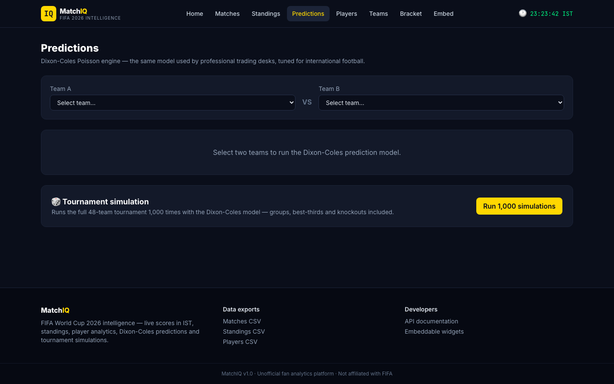
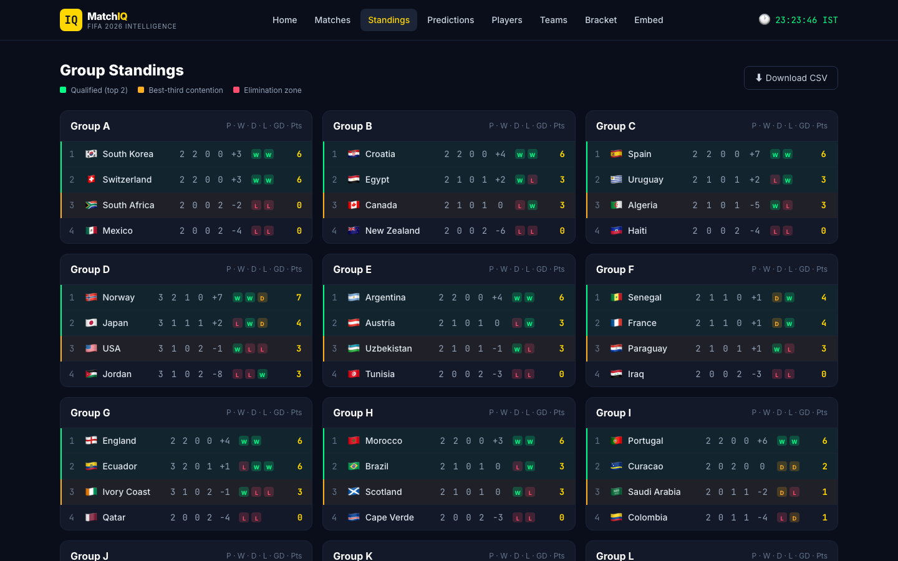
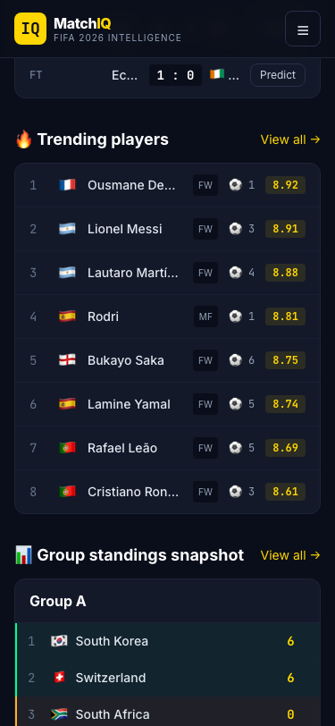

# ⚽ MatchIQ — FIFA World Cup 2026 Intelligence Platform

**Live demo: [matchiq-pi.vercel.app](https://matchiq-pi.vercel.app)** · **API docs: [matchiq-api-1sye.onrender.com/docs](https://matchiq-api-1sye.onrender.com/docs)**

Production-ready full-stack analytics dashboard for the FIFA World Cup 2026: live scores, group standings, player stats, Dixon-Coles match predictions, Monte Carlo tournament simulation, CSV data exports, and an embeddable score widget — dark, mobile-first UI with all match times in IST.

**→ Full documentation, quick-start, and API reference: [`matchiq/README.md`](matchiq/README.md)**

| | |
|---|---|
| Frontend | React 18 · Vite · TailwindCSS · Recharts · Framer Motion ([`matchiq/frontend`](matchiq/frontend)) |
| Backend | FastAPI · APScheduler · SQLite cache + fallback dataset ([`matchiq/backend`](matchiq/backend)) |
| Deploy | Vercel (frontend) · Render (backend, [`render.yaml`](render.yaml)) |

## Screenshots

| Predictions | Standings | Mobile (375px) |
|---|---|---|
|  |  |  |
