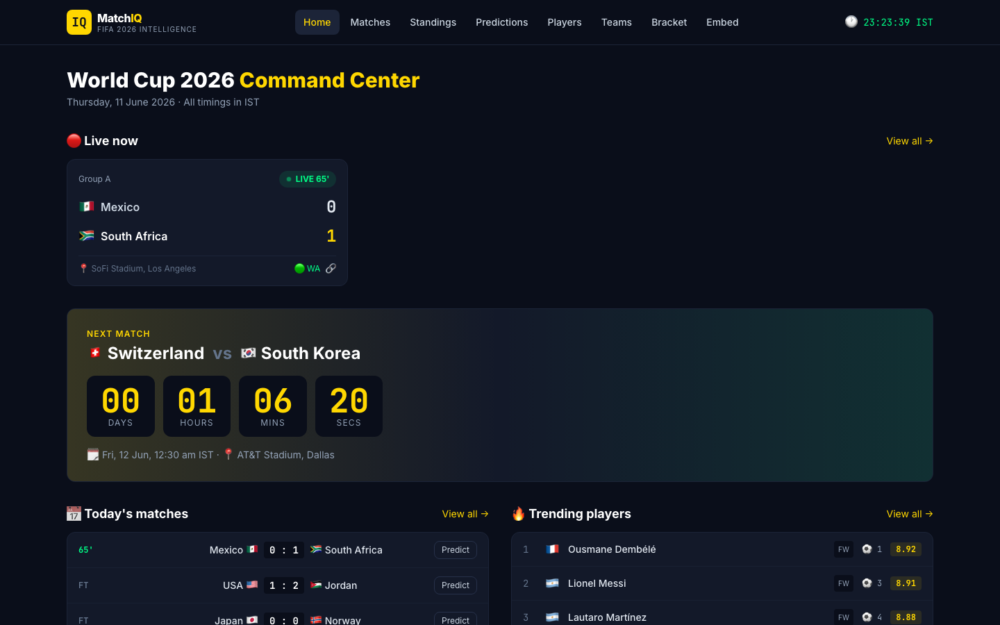

# ⚽ MatchIQ — FIFA World Cup 2026 Intelligence Platform

**Live demo: [matchiq-pi.vercel.app](https://matchiq-pi.vercel.app)** · **API: [matchiq-api-1sye.onrender.com](https://matchiq-api-1sye.onrender.com/docs)**

A production-ready, full-stack analytics dashboard for the FIFA World Cup 2026: live scores, group standings, player stats, Dixon-Coles match predictions, Monte Carlo tournament simulation, CSV data exports, and an embeddable score widget — all in a dark, mobile-first UI with IST match times.



## ✨ Features

- **Live dashboard** — live score cards with pulse indicators, next-match countdown, today's fixtures, standings snapshot, trending players
- **All times in IST** — built for the Indian audience first
- **12-group standings** — color-coded qualification / playoff / elimination zones
- **Prediction engine** — Dixon-Coles Poisson model giving win/draw/loss probabilities, expected goals, and most likely scorelines for any matchup
- **Tournament simulator** — 1,000-run Monte Carlo simulation of the full bracket with champion probabilities
- **Player analytics** — search/filter, form guides, side-by-side radar comparison
- **Interactive bracket** — all knockout matches, click-to-predict
- **CSV export API** — matches, standings, and players as downloadable CSV for analysts
- **Embeddable widget** — standalone HTML/CSS/JS score ticker & standings iframe (zero React dependency) for blogs and media sites
- **API-limit proof** — SQLite caching + bundled fallback dataset; the app keeps working even with no API key (demo mode) or when the free-tier limit is hit

## 🧱 Tech Stack

| Layer | Tech |
|---|---|
| Frontend | React 18, Vite, TailwindCSS, Recharts, Framer Motion, TanStack Query |
| Backend | FastAPI (Python 3.11), APScheduler, Pydantic |
| Data | API-Football (RapidAPI free tier) with SQLite cache + static fallback JSON |
| Deploy | Vercel (frontend) · Render (backend) |

## 🚀 Quick Start (local)

**Backend**

```bash
cd backend
python3 -m venv .venv && source .venv/bin/activate
pip install -r requirements.txt
uvicorn main:app --reload          # → http://localhost:8000 (docs at /docs)
```

**Frontend**

```bash
cd frontend
npm install
npm run dev                        # → http://localhost:5173
```

No API key needed for demo mode — the backend automatically serves the bundled fallback dataset. To use live data, copy `.env.example`, set `RAPIDAPI_KEY`, and restart.

## 🔌 API Endpoints

```
GET /api/matches/live              current live matches
GET /api/matches/today             today's matches (IST)
GET /api/matches/{id}              single match detail
GET /api/standings                 all 12 group standings
GET /api/standings/{group}         single group
GET /api/teams                     all teams
GET /api/players                   players with stats
GET /api/players/{id}              single player
GET /api/predictions/{home}/{away} Dixon-Coles prediction
GET /api/simulate                  1,000-run tournament simulation
GET /api/export/matches.csv        CSV download
GET /api/export/standings.csv      CSV download
GET /api/export/players.csv        CSV download
GET /health                        health check
```

Interactive docs: `http://localhost:8000/docs`

## 📦 Embed Widget

Add live scores or standings to any site with one iframe — no React required:

```html
<iframe src="https://matchiq-pi.vercel.app/embed.html?type=ticker&theme=dark"
        width="100%" height="120" frameborder="0"></iframe>
```

Options: `type=ticker|standings`, `theme=dark|light`, `group=A..L`.

## ☁️ Deployment

**Backend → Render**: connect the GitHub repo, Render reads `backend/render.yaml`. Set `RAPIDAPI_KEY` and `CORS_ORIGINS` in the dashboard.

**Frontend → Vercel**: import the repo with root directory `matchiq/frontend` (`vercel.json` included). Set `VITE_API_URL` to your Render URL.

## 📁 Project Structure

```
matchiq/
├── frontend/          React 18 + Vite + Tailwind app (7 pages, embed widget)
│   └── src/{components,pages,hooks,utils,styles}
└── backend/           FastAPI app
    ├── routers/       matches, standings, players, predictions, export
    ├── services/      football_api, cache, poisson (Dixon-Coles), scheduler
    ├── models/        Pydantic schemas
    └── data/          fallback_data.json (demo dataset)
```

## 📄 License

Commercial product — all rights reserved.
